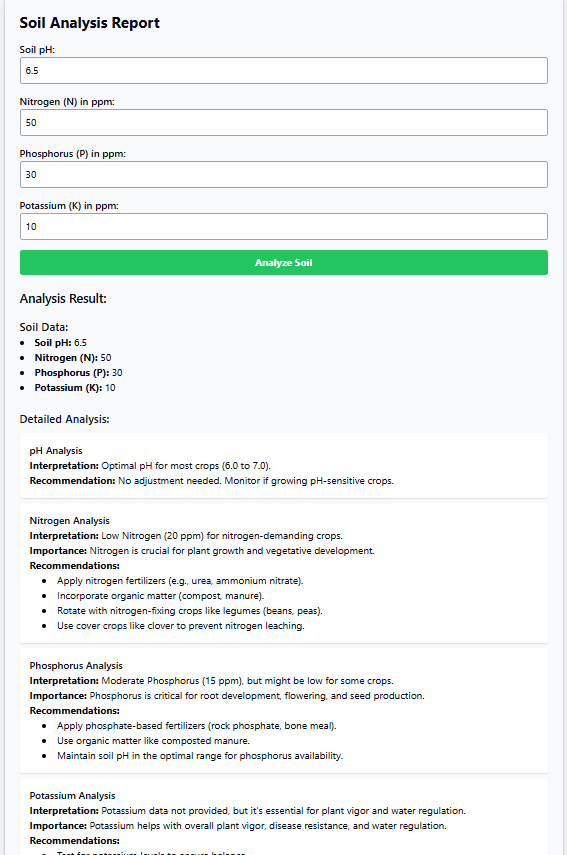

# Soil Analysis Backend

## Overview
The Soil Analysis Backend is a RESTful API that processes soil data and provides recommendations based on nutrient levels. This project aims to assist farmers and agricultural specialists in making informed decisions about soil management and crop selection.

### Features
- Input soil data (pH, Nitrogen, Phosphorus, Potassium).
- Analyze soil data and generate recommendations.
- Suggest crop types based on soil nutrient levels.
- Provide general recommendations for soil health maintenance.

## Technologies Used
- Node.js
- Express.js
- MongoDB (or your chosen database)
- Mongoose (for MongoDB object modeling)
- Body-parser
- dotenv (for environment variables)
- gemini

## Prerequisites
- Node.js (version 14.x or later)
- MongoDB (or another database of your choice)

## Installation

1. Clone the repository:
   ```bash
   git clone https://github.com/harshvardhan119/Soilanalysis.git
   ```

2. Navigate into the project directory:
   ```bash
   cd soil-analysis-backend
   ```

3. Install the dependencies:
   ```bash
   npm install
   ```

4. Set up environment variables:
   - Create a `.env` file in the root directory and add your MongoDB connection string:
     ```
     MONGODB_URI=your_mongodb_connection_string
     PORT=your_port_number
     ```

5. Start the server:
   ```bash
   npm start
   ```

## API Endpoints

### 1. POST /api/soil-analysis
**Description:** Submit soil data for analysis.

**Request Body:**
```json
{
    "soilData": {
        "pH": 6.5,
        "Nitrogen_ppm": 20,
        "Phosphorus_ppm": 15,
        "Potassium_ppm": 10
    }
}
```

**Response:**
```json
{
    "analysis": {
        "pH": {
            "interpretation": "...",
            "recommendation": "..."
        },
        "Nitrogen": {
            "interpretation": "...",
            "recommendation": ["..."]
        },
        ...
    },
    "generalRecommendations": {
        "mixedIntercroppingSystem": {
            "description": "...",
            "recommendation": ["..."]
        },
        ...
    }
}
```

### 2. GET /api/recommendations
**Description:** Retrieve general soil health recommendations.

**Response:**
```json
{
    "mixedIntercroppingSystem": {
        "description": "...",
        "recommendation": ["..."]
    },
    ...
}
```

## Testing
- You can use tools like Postman or Insomnia to test the API endpoints by sending requests and checking responses.
- Make sure your server is running before testing the endpoints.


## License
This project is licensed under the MIT License - see the [LICENSE](LICENSE) file for details.

## Acknowledgements
- Special thanks to [Your Name/Your Organization] for supporting this project.
- Inspired by agricultural research and soil health management practices.

---

Feel free to modify this README to fit your specific project needs and any additional features or endpoints you might add in the future.
```

### Notes
- Update the GitHub link and any other placeholders with your actual project details.
- Ensure to keep the README file up-to-date as your project evolves or changes.


